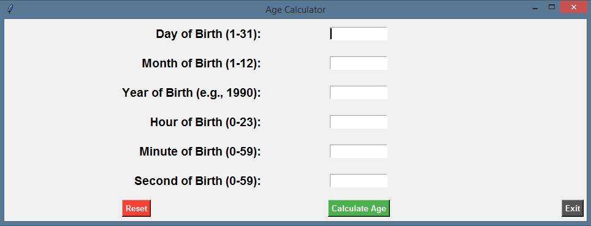

# Age Calculator Application

This project is an Age Calculator application built using Python's Tkinter library. The application provides a graphical user interface (GUI) where users can input their date and time of birth to calculate their current age in years, months, days, hours, minutes, and seconds. The application also features a "Reset" button to clear the inputs and start over, and an "Exit" button to close the application.

## Features

- **Age Calculation**: Computes the user's age based on the provided date and time of birth.
- **Reset Functionality**: Clears the input fields to allow users to enter new data.
- **Exit Button**: Closes the application.
- **User-Friendly Interface**: Designed with Tkinter for a clean and simple user experience.

## Technologies Used

- **Python**: Backend logic.
- **Tkinter**: For creating the GUI.
- **Pillow**: For handling image formats.
- **python-dateutil**: For manipulating dates and times.

## Project Structure

```plaintext
.
├── AgeApp.py            # Main application script
├── requirements.txt     # Python dependencies
├── README.md            # Project documentation
└── transparent.png      # Transparent background image
```

## Getting Started

### Prerequisites

Ensure you have the following installed:
- Python 3.x
- pip (Python package installer)

### Installation

1. **Clone the repository:**
    ```sh
    git clone https://github.com/mofasuhu/AgeCalculator.git
    cd AgeCalculator
    ```

2. **Install the required Python packages:**
    ```sh
    pip install -r requirements.txt
    ```

### Running the Application

1. **Download the `AgeApp.exe` file from the latest release. Double-click the `AgeApp.exe` file to run the application. Or run the application by executing the Python script:**
    ```sh
    python AgeApp.py
    ```

2. **Enter your date and time of birth in the provided fields.**
3. **Click the "Calculate Age" button to display your age.**
4. **Use the "Reset" button to clear the fields and start over.**
5. **Click the "Exit" button to close the application.**

## Screenshots




## Creating an Executable

To create an executable file for the application, use PyInstaller with the following command:

```sh
pyinstaller --onefile --windowed --icon=my.ico AgeApp.py
```

This will generate an `AgeApp.exe` file in the `dist` directory, which you can double-click to run the application without opening a terminal window.

## Code Overview

### `AgeApp.py`

- **calculate_age Function**: Validates input, calculates the age, and updates the age label.
- **reset_fields Function**: Clears all input fields and resets the application.
- **exit_program Function**: Stops any running threads and exits the application.
- **hide_components and show_components Functions**: Manage the visibility of input components and adjust the window size accordingly.

## Contributing

Contributions are welcome! Please fork the repository and create a pull request with your changes.

## License

This project is licensed under the MIT License - see the [LICENSE](LICENSE) file for details.

## Acknowledgements

- [Tkinter Documentation](https://docs.python.org/3/library/tkinter.html)
- [Pillow Documentation](https://pillow.readthedocs.io/)
- [python-dateutil Documentation](https://dateutil.readthedocs.io/)

## Author

Muhammad Farouk
